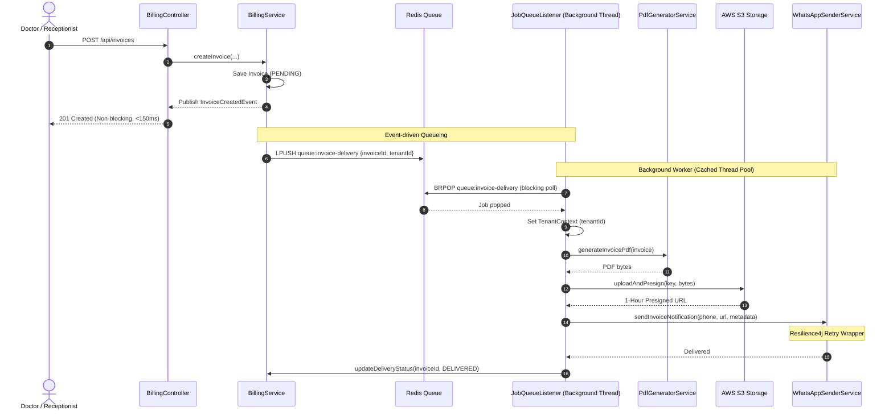

# ClinicOS: Multi-Tenant Clinic SaaS Backend

ClinicOS is a high-performance modular monolith backend for a multi-tenant clinic SaaS built using Java 17, Spring Boot 3.x, PostgreSQL 16 (using Row-Level Security), and Redis 7 (used for read-through caching and background job queueing).

This system provides:
1. Patient Registration (with demonstrable consent compliance under India's DPDP rules).
2. Digital Prescriptions (with fuzzy medicine autocomplete search and role-restricted clinical notes).
3. Invoicing (with asynchronous PDF billing delivery).
4. WhatsApp Cloud API Integration (delivering bill/prescriptions via pre-approved Meta message templates).

---

## 🛠️ Technology Stack

- **Java 17**: Baseline LTS compiler configuration.
- **Spring Boot 3.3.0**: Standard Spring MVC (blocking I/O optimized via cached background thread pool).
- **PostgreSQL 16**: Primary relational database with Row-Level Security (RLS) policies enabled.
- **Redis 7**: Used for read-through caching (medicine searches) and as a lightweight job queue.
- **Flyway**: Database schema migration tool.
- **Spring Security & JWT**: Stateless role-based access checks (ADMIN, DOCTOR, RECEPTIONIST) and password hashing via BCrypt.
- **AWS S3 / Cloudflare R2**: Object storage for generated invoice PDFs, accessed via short-lived (1 hour) pre-signed URLs.
- **Resilience4j**: Exponential backoff retries protecting external Meta WhatsApp API calls.

---

## 📂 Project Architecture & Package Structure

ClinicOS is designed as a **Modular Monolith** organized by domain features rather than technical layers. Cross-module database access is prohibited; modules communicate strictly via Service interfaces or Spring application events.

```
com.clinicsaas
├── ClinicSaasApplication.java
├── common/
│   ├── tenant/        # TenantContext, TenantFilter, Tenant Connection/DataSource, BaseTenantEntity
│   ├── security/      # JwtAuthFilter, SecurityConfig, UserPrincipal
│   ├── audit/         # AuditLog entity, PatientAuditAspect (AOP logging)
│   ├── exception/     # GlobalExceptionHandler, CustomException
│   └── config/        # RedisConfig, VirtualThreadExecutorConfig, S3Config, OpenAPIConfig
├── auth/
│   ├── controller/    # AuthController (register, login, create user)
│   ├── service/       # AuthService, JwtService
│   ├── repository/    # UserRepository, UserTenantRoleRepository
│   └── domain/        # User, UserTenantRole, Role
├── patient/
│   ├── controller/    # PatientController
│   ├── service/       # PatientService
│   ├── repository/    # PatientRepository
│   └── domain/        # Patient, PatientAddress
├── prescription/
│   ├── controller/    # PrescriptionController
│   ├── service/       # PrescriptionService
│   ├── repository/    # PrescriptionRepository, UnmatchedMedicineRepository
│   ├── domain/        # Prescription, PrescriptionItem, UnmatchedMedicineEntry
│   └── medicine/      # Medicine, MedicineRepository, MedicineCatalogService (Redis-cached, pg_trgm search)
├── billing/
│   ├── controller/    # BillingController
│   ├── service/       # BillingService (saves invoice, publishes InvoiceCreatedEvent)
│   ├── repository/    # InvoiceRepository
│   └── domain/        # Invoice, InvoiceItem, Payment
├── event/
│   └── InvoiceCreatedEvent
└── notification/
    ├── queue/         # JobQueueListener (consumes Redis BRPOP job queue on a background thread)
    ├── pdf/           # PdfGeneratorService (OpenPDF implementation)
    └── whatsapp/      # WhatsAppSenderService (Meta Cloud API with Resilience4j)
```

---

## 🔒 Multi-Tenant Isolation (Postgres RLS)

Every table storing clinic data includes a `tenant_id` column and PostgreSQL **Row-Level Security (RLS)** policies enabled:

1. **Authentication Scoping**: The login request body requires a `tenantId`, username, and password.
   - `users` is a global table (no RLS) allowing the auth system to retrieve the user's password hash without a tenant context.
   - The system then queries the `user_tenant_roles` table (which is RLS-protected). Since the `TenantContext` is initialized to the requested `tenantId`, RLS permits the role lookup.
   - Upon successful credentials matching, the system issues a stateless JWT containing the `tenantId`, `role`, and `isDoctor` flags.

2. **Connection Contextualization**: On every request, `JwtAuthFilter` extracts the `tenantId` from the JWT and binds it to a thread-local `TenantContext`.
3. **Database Hook**: The connection pool (HikariCP) is wrapped in `TenantAwareDataSource`. Whenever Hibernate requests a connection and starts a transaction (triggering `setAutoCommit(false)`), our dynamic connection proxy `TenantAwareConnection` intercepts the invocation and executes:
   ```sql
   SET LOCAL app.current_tenant = '{active-tenant-uuid}';
   ```
4. **Enforcement**: Because Postgres policies are defined as `USING (tenant_id = current_setting('app.current_tenant', true)::uuid)`, if application code contains a bug or omits a `WHERE tenant_id = ?` clause, the database will automatically reject and filter out rows belonging to other clinics.
5. **Admin Bypass Safeguard**: RLS policies are created with `FORCE ROW LEVEL SECURITY` to ensure security checks apply even when running commands under the table owner user.

---

## 👥 Roles & Access Controls

- **Roles**: Three roles are supported: `ADMIN`, `DOCTOR`, and `RECEPTIONIST`.
- **Clinical Notes Redaction**: Receptionist and admin roles cannot read patient diagnostic or consultation notes.
  - At the service layer (`PrescriptionService`), retrieving digital prescriptions checks the user's role and `isDoctor` status.
  - For non-doctors, the `diagnosis` and `consultationNotes` fields are automatically redacted (set to `[REDACTED - DOCTORS ONLY]`) before being returned as a DTO.
  - Admins do not automatically see clinical notes unless they have a `DOCTOR` role or are flagged with `is_doctor = true` in their tenant mapping.
- **DPDP Consent Audit**: The `Patient` entity includes a `consentGivenAt` timestamp captured at registration, satisfying India's DPDP rules.
- **AOP Patient Auditing**: An AOP aspect (`PatientAuditAspect`) intercepts all read/write methods inside the `patient` and `prescription` modules. It extracts patient IDs, accessor usernames, and timestamps, and logs them to the `audit_logs` table (which is RLS-protected). This guarantees that auditing cannot be bypassed or forgotten by developers.

---

## ⚡ Asynchronous Invoice Delivery Pipeline



1. **Non-blocking API response**: When an invoice is created, it is saved with a `PENDING` delivery status, an `InvoiceCreatedEvent` is published, and the HTTP response is returned immediately.
2. **Background Worker**: `JobQueueListener` executes a polling loop inside a background thread (cached thread pool), calling a blocking pop (`opsForList().rightPop` / `BRPOP`) on the Redis queue.
3. **Tenant Binding**: Once a job is popped, the background worker binds the `tenantId` to the `TenantContext`, allowing the worker to query RLS-protected invoice and patient records.
4. **PDF compilation**: `PdfGeneratorService` constructs the PDF in-memory.
5. **Pre-signing**: The PDF is uploaded to S3, and the client generates a secure pre-signed GET URL expiring in 1 hour.
6. **Meta WhatsApp Cloud API**: `WhatsAppSenderService` dispatches the PDF pre-signed URL as a document header alongside name parameters using Meta's Cloud API template. The call is wrapped in a Resilience4j Exponential Backoff Retry.
7. **Failure States**: If the API call fails after all retry attempts (3 max), the worker updates the invoice's delivery status to `FAILED`.

---

## 💊 Medicine Autocomplete Catalog

- **Fuzzy autocomplete**: Medicine searches target the global `medicines` table using a native query leveraging the Postgres `pg_trgm` index and `similarity()` function.
- **Read-Through Redis Cache**: Autocomplete queries are cached in Redis (`medicine_search` cache).
- **Explicit Invalidation**: Cache entries are completely evicted when an admin updates or adds a medicine to the catalog to prevent stale results.
- **Unmatched Entries logging**: If a doctor inputs a drug name not in the catalog, the application logs the entry to the `unmatched_medicine_entries` table, ensuring prescriptions can be generated without blocking on catalog updates.

---

## 🚀 Getting Started

### Prerequisites
- Java 17 (Temurin JDK)
- Maven 3.9+
- Docker & Docker Compose (optional, for local DB and cache)

### 1. Start Infrastructure
Start PostgreSQL 16 and Redis 7 using the provided Docker Compose configuration:
```bash
docker-compose up -d
```

### 2. Configure Environment
Copy `.env.example` to `.env` and fill in credentials. Standard values for local development are pre-configured in `src/main/resources/application.yml`.

### 3. Compile and Run
To build the package and execute compilation:
```bash
mvn clean compile
```

To run the application:
```bash
mvn spring-boot:run
```
Once started, the OpenAPI dynamic docs and Swagger UI will be available at:
- API Documentation: `http://localhost:8080/v3/api-docs`
- Swagger UI: `http://localhost:8080/swagger-ui/index.html`

---

## 🧪 Integration Tests

The codebase includes two comprehensive integration test suites located in `src/test/java/com/clinicsaas`:
1. `TenantIsolationIntegrationTest`: Proves that a user from Tenant B cannot fetch or read patient records owned by Tenant A, validating database-level RLS policies.
2. `AsyncInvoiceDeliveryIntegrationTest`: Proves that creating an invoice returns a response in `< 250ms` and that the Redis queue worker processes the PDF compilation, mocks S3, mocks WhatsApp delivery, and transitions the invoice status to `DELIVERED` asynchronously.

*Note: The test suite includes a custom `DockerRunningCondition` that automatically skips Testcontainers execution if the Docker daemon is not running on the host system, ensuring standard builds do not break.*
```bash
mvn test
```
